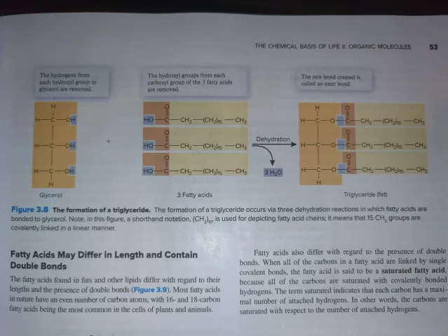
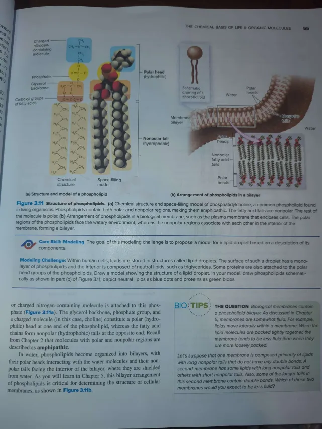

- Lipids are hydrophobic molecules of mainly hydrogen and carbon, with little oxygen
	- Defining feature is nonpolar and insoluble
	- Lipids are 40% of all organic matter in average human of fats phospholipids, steroids, and waxes.
	- Lipids can associate with each other noncovalently to form complex structures such as those in membranes
		- They are not considered to be molecules because they are not composed of many monomers that are covalently connected
- Triglycerides are made from Glycerol and Fatty Acids.
	- Triglycerides (often called fats) are formed when glycerol bonds to three fatty acids.
		- Glycerol is a 3 carbon molecule with one hydroxyl group bonded to each carbon
		- A fatty acid is a chain of carbon and hydrogen atoms with a carboxyl group (-COOH) at one end
		- Each -OH in glycerol is linked to the carboxyl group of a fatty acid by dehydration reaction.
			- The resulting bond is an ester bond.
		- Formation PIcture:
			- 
- Fatty Acids May Differ in Length and Contain Double Bonds
	- The fatty acids in fat and other lipids differ with regard to their lengths and the presence of double bonds
		- Most fatty acids in nature have an even number of carbon atoms
			- 16-18 carbon fatty acids being the most common in the cells of plants and animals
	- Fatty acids also differ with regard to the presence of double bonds
		- When all carbon in fatty acid are linked by a single covalent bond, the fatty acid is a **Saturated Fatty acid** as all carbons are saturated with covalently bonded hydrogens.
		- The term saturated indicates that each carbon has a maximal number of attached hydrogens.
		- The carbons are saturated with respect to the number of attached hydrogens.
	- Some fatty acids contain one of more C=C double bonds.
		- They are unsaturated fatty acids
		- The C=C double bond introduces kinks into the linear structure of a fatty acid.
		- One C=C bond is a monounsaturated fatty acid
		- Fatty acid with 2+ C=C bond is a polyunsaturated fatty acid
	- In organisms like mammals, fatty acids are necessary for good health but cannot be synthesized by the body
		- They are essential fatty acids because they are only obtained by diet
	- Fats (triglycerides) that contain high amounts of saturated fatty acids pack tightly making numerous intermolecular interactions that stabilize the fat.
		- Therefore, high melting point and is solid at room temperature
		- Animal fats have the saturated fatty acids
	- Because of kinks in the chains, unsaturated fatty acids do not pack together as tightly as saturated fatty acids. Thus, low melting point and is liquid at room temperatures
		- They are called oils as a result.
	- Most of these unsaturated fatty acids exist in the cis form.
		- HOWEVER, trans patty acids (which turn the cis form to trans configuration to compact them more) with their solid state and their longer shelf life exist
		- They also cause human diseases like coronary artery disease.
	- Fats are also important for storing energy
		- Hydrolysis of triglycerides releases the fatty acids from glycerol.
		- Then it is metabolized to provide energy to make ATP
		- This is why organisms store a lot of fat to store lots of energy
		- Number of C-H bonds in a fat or carbohydrate molecule determines how much energy a molecule cna yield
			- Fats contain many C-H bonds whereas glucose and other carbohydrates have numerous C-OH bonds
		- They can also cushion organs and provide additional insulation under the skin that protects animals in cold weather and marine mammals from cold water
- Phospholipids are Amphipathic Lipids
	- Phospholipids are similar in structure to triglycerides with one difference: In a phospholipid, the htird hydroxyl group of glycerol is linked to a phosphate group instead of a fatty acid.
		- Most phospholipids have a small polar or charged nitrogen-containing molecule attached to the phosphate.
		- A glycerol backbone, phosphate group, and a charged molecule creates a polar head at one end (whereas the fatty acid creates nonpolar tails at the opposite end)
			- Thus it is amphipathic
		- In Water Phospholipids become organized into bilayers, with polar heads interacting with water molecules and non-polar tails facing the interior of the bilayer.
			- Structure of Phospholipids and Bilayer
				- 
- Steroids Contain Ring Structures
	- Steroids have a distinctly different chemical structure from other types of lipid molecules so far
		- Four fused rings of carbon (S shape)
		- 1+ polar hydroxyl groups are attached to the fused ring structure, but not enough to make it water-soluble
		- In Steroids, minor differences in chemical structure result in profoundly different biological properties.
			- E.g. All steroid hormones are derived from cholesterol and share similarities in structure, but with important differences.
				- Estrogen is a steroid hormone found in females. It only differs from Testosterone by having one less methyl group and a hydroxyl group instead of a ketone group with additional double bonds in one of its rings.
				- These small differences determine if you are a man or a woman
				- Image showing diff:
					- 
- Waxes are Complex Lipids That Prevent Water Loss from Organisms
	- Many plants and animals make lipids called waxes that are secreted onto their surface.
		- Although any wax contains hundreds of different compounds, all of them contain one or more hydrocarbons and long structures that resemble a fatty acid attached by its carboxyl group to another long hydrocarbon chain.
		- Waxes are non-polar and doesn't allow water movement so less water loss occurs.
		- Waxes are also used in structural elements, like in a honeycomb in a beehive