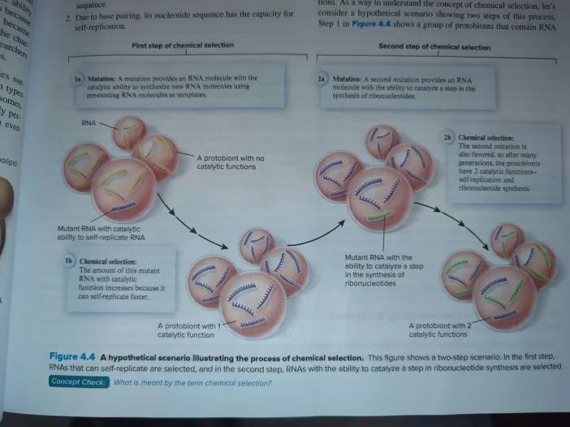

- Living cells are complex collections of molecules and macromolecules.
	- DNA has genetic info, RNA is the intermediary in protein synthesis and plays other important roles
	- Protein forms the foundation for the structure and activities of living cells
	- Like all this stuff came from a pre-existing cell
- But how did we get life?
	- Three stages:
	- Nucleotides and amino acids were produced prior to existence of cells
	  logseq.order-list-type:: number
	- Nucleotides polymerized to form RNA or DNA and amino acids polymerized to form proteins
	  logseq.order-list-type:: number
	- Polymers became enclosed in membranes
	  logseq.order-list-type:: number
	- Polymers enclosed in membranes acquired properties that are associated with living cells via chemical selection
	  logseq.order-list-type:: number
- Stage 1: Organic Molecules Formed Prior to the Existence of Cells
	- 1920s, Russian biochemist Alexander Oparin and Scottish biologist J.B.S. Haldane both came up with the idea that organic molecules arose spontaneously under early earth conditions.
		- This spontaneous appearance created our "primordial soup"
		- The conditions, being very different, may have been more allowing of making organic molecules
		- Current hypotheses say that organic molecules and soon macromolecules formed spontaneously
		- This is a previotic or abiotic synthesis.
			- With low oxygen, no one was just oxidized and with no living organisms, no one was metabolized.
			- So accumulation of the molecules made the soup
		- We can agree it is random making of life but we debate how it all came. We got 3 hypotheses
			- Reducing Atmosphere Hypothesis
			  logseq.order-list-type:: number
			- Extraterrestrial hypothesis
			  logseq.order-list-type:: number
			- Deep-sea Vent Hypothesis
			  logseq.order-list-type:: number
	- **Reducing Atmosphere Hypothesis**
		- Many scientists in the 50s proposed that atmosphere on early earth had lots of water vapor, hydrogen gas, methane, and ammonia
		- With little oxygen, the atmosphere was reducing since ammonia and methane readily gave up electrons to other molecules thus reducing them
			- This is an oxidation-reduction reaction
			- Required to make complex organic molecules from simple inorganic molecules
		- 1953 Stanley Miller (American Chemist, student in laboratory of physical chemist Harold Urey) was the first scientist to use experimentation to test whether prebiotic synthesis of organic molecules is possible
			- Water vapor from flask rose to chamber of hydrogen gas, methane, and ammonia.
			- He literally shocked them with electrodes to simulate lightning bolts and a condenser jacket cooled some gases from the chamber, making droplets form that fell into a trap.
			- The results was Hydrogen Cyanide, Formaldehyde (precuror of complex organic molecules)
				- They also made larger molecules like amino acid glycine
				- At the end, 10-15% of the carbon has been made into an organic compound
				- Later experiments by MIller and others shown formation of sugars, amino acids, lipids, and nucleic acids
		- 2011, researchers analyzed samples that Miller preserved from a 1958 experiment with a methane, ammonia, hydrogen sulfide, and carbon dioxide mixture.
			- He didn't analyze them
			- But they found 23 different amino acids and 4 amines, more than his previous experiments
		- These were important because it shown that prebiotic synthesis is in fact possible
			- Can't prove it really occurred though
			- Some criticisms came up
			- Earth was maybe not reducing but instead was a neutral gaseous mixture of carbon monoxide, carbon dioxide, nitrogen, and water vapor.
				- This is from studies on volcanic gaas with much more of these
				- Additionally, there was UV radiation destroying methane and ammonia
			- Still could be present in localizing regions.
			- Other studies shown same thing possible in other conditions.
				- E.g. CO, CO2, N2, and H2O can make organic molecules
	- Extraterrestrial Hypothesis
		- People say sufficient organic molecules may have came from asteroids and comets reaching Earth.
		- This is because a lot of meteorites may belong to a class known as carbonaceous chondrites.
			- They may have lots of organic carbon (amino acids and nucleic acid bases)
			- These meteorites could transfer a lot of organic molecules to early Earth
		- However opposers say that it would all be burned up or blown up through the meteor. It can survive, just how much of it though
	- Deep-Sea Vent Hypothesis
		- 1988 German lawyer and organic chemist Gunter Wachtershauser proposed the organic molecules cam efrom deep-sea vents
			- These are cracks in Earth's surface where super hot water w/metal ions and hydrogen sulfide mixes abruptly with cold seawater
			- People say in the middle ground of super hot (300C) water and cold water made the organic molecules.
		- This is supported by the communities found in vicinity of modern deep-sea vents.
		- Lots of various species are found in abundance in those areas
		- They just take chemical energy, no sunlight
		- 2000 new type also found called alkaline hydrothermal deep-sea vent.
			- Life could've formed from the gradient of alkaline vent water and acidic seawater.
			- With more CO_{2} in perbiotic waters (more acidic), we could have the process of organic molecules this way
		- 2007 American Timothy Kusky and colleagues found 1.4 billion year old fossils of deep-sea microbes near ancient deep-sea vents
			- More Evidence therefore of life that came from the bottom of the ocea
		- Still debated
- Stage 2: Organic Polymers May Have Formed on the Surface of Clay
	- Second stage could be a period where simply organic molecules polymerized into complex organic polymers like DNA, RNA, or proteins.
		- Most ideas regarding this assume polymers of at least 30-60 monomers are needed to store enough information for viable genetic systems.
		- Due to hydrolysis goes against polymerization, scientists say it didn't happen in a soup, but instead on solid surface or evaporating tidal pools
	- 1951 Irish X-ray Crystallographer John Bernal suggested prebiotic synthesis of polymers came from caly.
		- This is because clay minerals are known to bind organic molecules such as nucleotides and amino acids
		- Experimentally this was proven through formation of nucleic acid polymers and polypeptides on the surface of clay with monomers
			- During prebiotic synthesis of RNA, the purine bases of the nucleotides could interact with teh silicate surfaces of the clay.
			- Cations like magnesium could bound to nucleotides to negative clay surfaces. This positions nucleotides in a better way to form bonds of phosphate of a nucleotide and ribose sugar of an adjacent one.
			- This creates RNA
	- Supported but Studies by American Chemist Luke Leman + Leslie Orgel (English) + M. Reza Ghadiri (Iranian-American) indicates that polymers can also form in aqueous solutions vs the prevalent view
		- 2004 shows that carbonyl sulfide, a simple gas in volcanic gases and deep-sea vent emissions, can still form peptides from amino acids under mild conditions in water
		- Still pushes pre-biotic soup
- Stage 3: Cell-Like Structures May Have originated When Polymers were enclosed by a Boundry
	- This is when a barrier separated the RNA from the environment
	- Protobiont: An Aggregate of prebiotically produced molecules and macromolecules that acquired a boundry, like a lipid bilayer, allowing it to maintain an internal chemical environment distinct from that of its surroundings.
	- Characteristics making protobiont a precursor of living cells:
		- A boundary (membrane) separated from internal contents from external contents
		  logseq.order-list-type:: number
		- Polymers inside the protobiont contained information
		  logseq.order-list-type:: number
		- Polymers inside the protobiont had catalytic functions
		  logseq.order-list-type:: number
		- The protobionts eventually developed the ability for self-replication
		  logseq.order-list-type:: number
	- They can precisely self-reproduce, but could just divide and increase in number.
		- They shown basic metabolic pathways where organic molecules were restructured
		- Remarkabl: polymer inside protobiont gaining catalytic ability to link organic building blocks to make new polymers
		- Critical for self-replication
		- With this scenario, the pathways became more complex and let the self-replication ability be more refined.
	- They could have been liposomes
		- These are vesicles surrounded by a phospholipid bilayer
		- When some lipids are dissolved in water, they can form liposomes.
		- As they are selectively permeable, they can even store energy in the form of an electrical gradient
		- Can discharge this in a neuron like fashion showing signs of excitability
	- 2003 Danish chemist Martin Hanczyc, American Chemist Shelly Fujikawa, and Canadian-American Biologist Jack Szostak showed clay can catalyze the formation of liposomes that grow and divide (primitive self-replication)
		- If RNA was on the clay, liposomes enclosed RNA
		- Showed formation of membrane-enclosed vesicles containing RNA is plausible for cell-like sturctures to emerge
- Stage 4: Cellular Characteristics may have Evolved via Chemical Selection, Beginning with an RNA world
	- RNA likely the first one. Unlike others, RNA has these functions:
		- Can store information in its nucleotide base sequence
		  logseq.order-list-type:: number
		- Base pairing enables self-replication
		  logseq.order-list-type:: number
		- RNA can do catalytic functions. Experiments show RNA can function as a ribozyme, an RNA molecule that catalyze chemical reactions
		  logseq.order-list-type:: number
	- Simply put, DNA and proteins are not as versitile as RNA
	- DNA is limited in catalytic ability and proteins cannot do self-replication
	- How did RNA turn more complex that made cell like characteristics?
		- They say Chemical selection, when a chemical within a mixture has properties or advantages that cause it to increase in amount compared to other chemicals in the mixture
		- This creates Chemical Evolution, where a population of molecules change over time to become a new population with a different chemical composition
	- Initially, the properties that let RNA undergo chemical selection were just self-replication and ability to perform other catalytic functions
	- To understand, lets see a hypothetical with two steps of the process
		- Step one: A group of protobionts have RNA molecules formed prebiotically. They are templates for prebiotic synthesis of complementary RNA molecules. It is slow without catalysts.
			- The sequence of one of the RNA molecules however undergoes a mutation that give sit the catalytic ability to attach nucleotides together using other RNA molecules as a template
			- Fast self-replication so protobionts just have more of this. And soon the only type
		- Step two has a second mutation that could make catalytic function that helps promote synthesis of ribonucleotides, building blocks of RNA.
			- E.g. A hypothetical ribozyme can catalyze attaching a base to a ribose.
			- Doesn't rely on prebiotic synthesis of ribonucleotides
			- These two abilities give it the advantage as it is the only proto-biont that can self-replicate. Increase in number again as a result
	- Step images:
		- 
	- The RNA World was a hypothetical period on Early Earth when both the information neede dfor life and the catalytic activity of living cells was only in RNA molecules.
		- Protobionts carrying RNA showed prroperties of life due to RNA genomes that copied and maintained through the catalytic function of RNA molecules
		- Over time, scientists thought mutations in RNA molecules could introduce new functional possibilities.
			- This chemical selection could make more complex features in protobionts with RNA molecules accruing abilities like linking amino acids to proteins with other catalytic functions
		- It is also palusible as American biologists David Bartel and Jack Szostak conducted a study in 1993.
			- Select RNA molecules with catalytic ability to link nucleotides together, then after 10 rounds of selection, they found an RNA molecule that had catalytic activity that was 3 million times higher than the original random collection of molecules
			- Yeah RNA molecules over time can infact change.
- The RNA World Was Superseded by the Modern DNA/RNA/Protein World
	- Was first superseded by a DNA/RNA world or an RNA/Protein world before. Better than RNA world because...
	- Information storage
	  logseq.order-list-type:: number
		- RNA can store information in its base sequences, so why double it with DNA?
		- In the RNA world, RNA had to perform two roles, store information and catalyzing chemical reactions
		- By incorporating DNA into cells, it could relieve RNA of its storage role letting RNA performing other functions
			- E.g. DNA store information, RNA molecules bind cofactors or catalyze other stuff
		- DNA is also just more stable. Less likely to break
		- Another thing is that Eukaryotic cells can also use RNA as a template to make DNA. This is the proposed way in which DNA came to be
	- Metabolism and Other Cellular Functions
	  logseq.order-list-type:: number
		- Why proteins? Because proteins are catalysts and that benefits early cells.
		- Because having 20 amino acids mean greater catalytic ability than RNA.
		- Proteins can also do other important roles like membranes and other structural stuff
		- How protein? Because Chemical selection experiments shown RNA catalyzing forming peptide bonds and even attaching amino acids to primitive tRNA molecules.
			- Similarly, modern protein synthesis still includes a central role for RNA in the synthesis of polypeptides.
			- First, mRNA provides information to polypeptide sequence
			- Then, tRNA act as adaptors for the formation of polypeptides
			- Finally ribosomes containing rRNA provides site for polypeptide synthesis
			- Furthermore, rRNA in the peptidyl transferase complex within ribosomes act as a ribozyme to catalyze peptide bond formation.