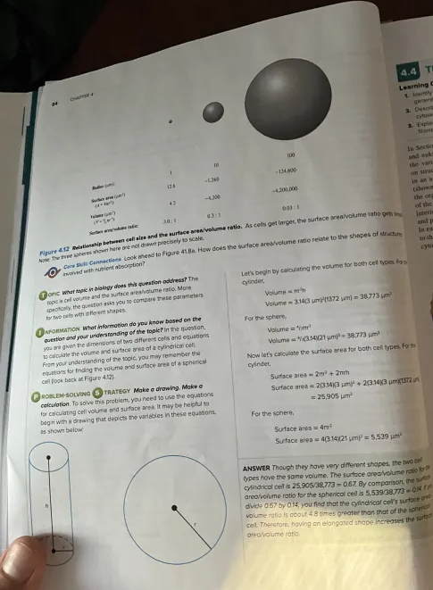

# Cell Structure and function are primarily determined by four functions
	- Matter
	  logseq.order-list-type:: number
		- [[Chapter 2: The Chemical Basis of Life 1: Atoms, Molecules, and Water]]
		  logseq.order-list-type:: number
		- [[Chapter 3: The Chemical Basis of Life 2: Organic Molecules]]
		  logseq.order-list-type:: number
	- Energy
	  logseq.order-list-type:: number
		- Needed to produce molecules and macromolecules and to carry out many cellular functions
		  logseq.order-list-type:: number
	- Organization
	  logseq.order-list-type:: number
		- Underlies a cell's structure and function
		  logseq.order-list-type:: number
		- Not just a random ass bag, the molecules and macromolecules are in specific sites
		  logseq.order-list-type:: number
		- All living cells can build and maintain their internal organization.
		  logseq.order-list-type:: number
			- Proteins bind to each other like legos.
			  logseq.order-list-type:: number
			- These Protein-protein interactions create intricate cell structures and facilitate processes in which proteins interact in a consistent series of steps
			  logseq.order-list-type:: number
	- Information
	  logseq.order-list-type:: number
		- This is the instructions found in the blueprint of life, like the genetic material.
		  logseq.order-list-type:: number
		- Each organisms and species has a unique genome, for instance. Each cell has this copy
		  logseq.order-list-type:: number
			- This is then passed to offspring and many more
			  logseq.order-list-type:: number
			- Genes of each species contain the information to produce thousands of different proteins
			  logseq.order-list-type:: number
- # Prokaryotic Cells have a Simple Structure
	- We have two categories of prokaryotes and eukaryotes
	- Prokaryotic ones are simple, and comes from Greek pro and karyon, meaning before a kernel (the kernel like appearance of what would be the cell nucleus as prokaryotes lack membrane enclosed nucleus)
	- ## Two categories of organisms composing prokaryotic cells are bacteria and archaea.
		- TINY, 1 micrometer to 10 micrometers in diameter
		- We know bacteria, tiny and can help, harm, and be important
		- Archaea are also around the world but are less common than bacteria. They occupy extreme environments like hot springs and deep-sea vents
	- ## In a typical bacterial cell:
		- The plasma membrane (phospholipid bilayer with embedded pro5teins) forms important barriers between the interior of the cell and the external environment
		- The cytoplasm is the region of cell contained within the plasma membrane
			- Features in bacterial cytoplasm are visible via microscopy
			- Includes nucleoid containing genetic material
			- Ribosomes, involved in polypeptide synthesis (#polypeptide #synthesis )
			- Some exist outside of their plasma membrane
		- Nearly all species of bacterial and archaea have a rigid cell wall to support and protect plasma membrane and cytoplasm (#cell-wall )
			- The composition varies widely, but has peptides and carbohydrates
			- Is porous, letting most nutrients in the environment reach the plasma membrane
			- Many bacteria also secrete glycocalyx, an outer viscous covering surrounding the bacterium. It traps water and prevents bacterium from drying out.
				- Invading bacteria produce very thick glycocalyx called a capsule that avoids being destroyed by the immune system or may aid in the attachment to cell surfaces
			- Many prokaryotic cells have appendages like pili and flagella
				- Pili lets cells attach to surfaces and flagella provide prokaryotic cells with the ability to move (#motility )
		- Picture of a typical bacteria cell:
			- 
- # Eukaryotic Cells are Compartmentalized by Internal Membranes to Create Organelles
	- ## All other species are eukaryotes (Greek: True nucleus)
		- This includes protists, fungi, plants, and animals
			- Paramecia and algae are types of protists
			- Yeast and molds are a type of fungi
	- ## They have the true nucleus where most of the DNA is stored
		- A nucleus is a type of organelle, a membrane-bound compartment with its own unique structure and function
	- ## In comparison to prokaryotic cells, eukaryotic cells have extensive compartmentalization, meaning they have many membrane-bound organeels that separate the cell into different regions.
		- This lets a cell carry out specialized chemical reactions in different places
	- ## Some features of cell organization, like a nucleus are all found in nearly all eukaryotic cells
		- The shape, size, and organization of the cells vary considerably among different species and even among different cell types of the same species
		- E.g. Micrographs of a human skin cell and a human neuron have huge differences in morphologies despite having the same types of organelles
		- Plant cells possess a collection of organelles similar to those found in plant cells. But they also have chloroplasts, a central vacuole, and a cell wall
	- Animal Cell image:
		- 
	- Plant Cell Image:
		- 
- # Droplet Organelles Are a Category of Organelles Whose Boundary is due to Phase Separation
	- ## Most organelles covered above are surrounded by a single or double membrane.
	- ## But recently researchers have discovered cells that can also become compartmentalized by a second mechanism called liquid-liquid phase separation
		- This is where aggregated solutes, like proteins and RNA molecules separate from the bulk solvent and form a droplet
		- It has a spherical shape with a measurable surface tension and viscosity
		- Molecules can diffuse within the droplet and occasionally leave it and pass into the surrounding liquid phase
		- Now that they are recognized, they are called **droplet organelles**
			- An example is the nucleolus, the site for rRNA processing and the assembly o ribosomal subunits
	- ## The reason why they are structured like this is to serve two purposes.
		- Molecules are brought close together and can assemble into complexes
		  logseq.order-list-type:: number
			- E.g. ribosomal subunits assemble within the nucleolus
			  logseq.order-list-type:: number
		- The environment within the droplet is chemically different from the surroundings, affecting events like RNA folding
		  logseq.order-list-type:: number
- # The Characteristics of a Cell Are Largely Determined By the Proteins it Makes
	- ## Many organisms like animals and plants are multicellular
	- ## However, the cells of most multicellular organisms are not all identical.
		- E.g. your body has skin cells, neurons, muscle cells, and many other types.
	- ## So here is the question: how does a single organisms produce different types of cells?
	- ## To figure this out, we must known genome vs proteome
		- Genome has all genetic material like DNA, which has many genes
		- Most genes encode production of polypeptides, assembling into functional proteins
		- However the **proteome** is defined as the complete set of proteins that a cell can make.
			- This determines the cell type
			- One set of proteins made in one cell type is not the same as that made in a different cell type
			- E.g. Skin vs Neuron cells. Why?
				- Certain proteins in skin cells may not be produced in neurons and vice versa
				  logseq.order-list-type:: number
				- Skin cells and neurons may produce the same protein but in different amounts (due to gene regulation and the rates where protein is synthesized and degraded)
				  logseq.order-list-type:: number
				- The amino acid sequences of particular proteins can var in skin cells and neurons
				  logseq.order-list-type:: number
					- The mRNA from a single gene can produce two or more polypeptides with different amino acid sequences via a process of alternative splicing
					  logseq.order-list-type:: number
				- Skin Cells and neurons may alter their proteins in different ways
				  logseq.order-list-type:: number
			- These reasons, skin cells and neurons produce different sets of proteins, that is different proteomes
			- Proteomes of cells responsible for traits of organisms like color of one's eyes
				- Changes also related to disease, where healthy vs cancerous lungs make different proteins and as the cancer progresses
- # Surface Area and Volume are critical Parameters that affect Cell Sizes and Shapes
	- ## Common feature of cells is being small and is near universal
		- E.g. Bacterial cells are 1-10 micrometers in diameter and eukaryotic cells being 10-100 micrometers in diameter, but some exceptions arise with ostrich eggs but oh well
	- ## Why are cells small?
		- The interface of the cell and its extracellular environment (the cells plasma membrane)
		  logseq.order-list-type:: number
			- Cells need to import substances through plasma membranes and export waste products
			  logseq.order-list-type:: number
			- Large internal volume requires greater amounts of nutrient uptake and waste export
			  logseq.order-list-type:: number
		- The rate of transport of substances across a plasma membrane is lim8ted by surface area
		  logseq.order-list-type:: number
			- While surface area is 4pir^{2}  volume increases with 4/3pi r^{3}
			  logseq.order-list-type:: number
	- Example of such phenomena
		- 